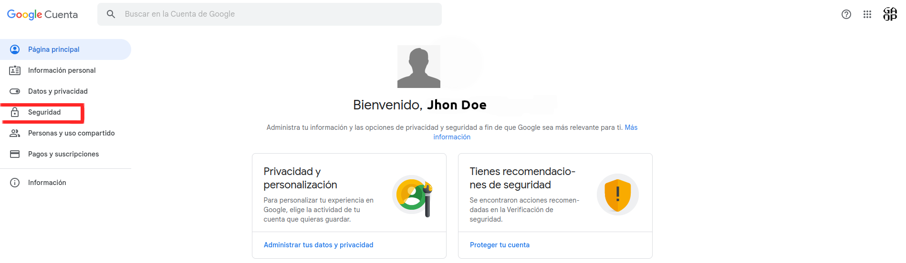
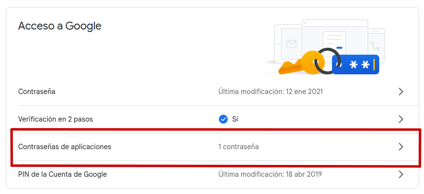
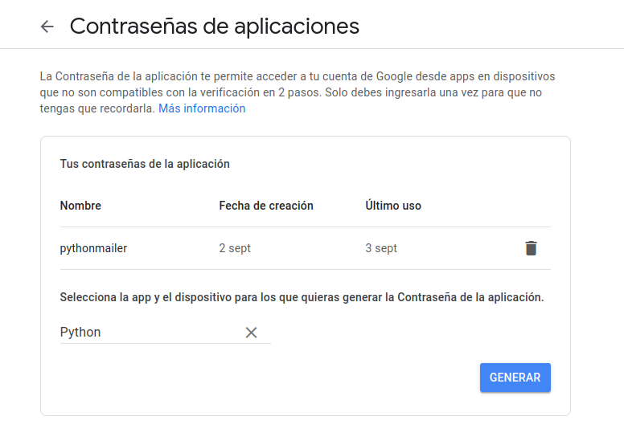
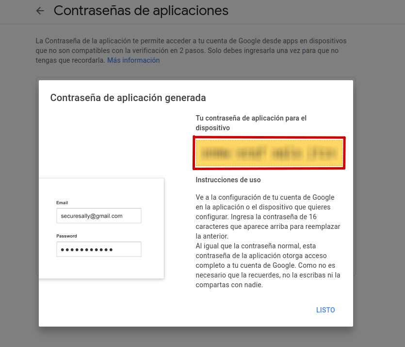
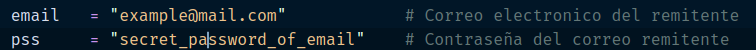

# Script para enviar emails desde tu cuenta de Google

## Introducción

En este script hacemos uso de las librerías de Python para enviar correos electrónicos desde la terminal.

Esta especie de "aplicación de consola" recibe como argumentos el correo electrónico destinatario, el asunto del correo y el mensaje.

## Pre-requisitos

Antes de utilizar el script debes habilitar la _Autenticación en dos pasos_ de una cuenta de Google.

1. Ingresa a _Administrar tu Cuenta de Google_

2. Clic en la sección _Seguridad_

   

3. En la sección _Acceso a Google_, clic en _Contraseñas de aplicaciones_

   

4. Seleccionar tipo de app como **Otra (nombre personalizado)** y asígna un nombre con el cuál puedas identificar la aplicación. Haz clic en _Generar_

   

5. Obtendrás una contraseña generada de forma automática de 16 dígitos.

   

6. Dentro del código del script, las líneas 16 y 17 reemplázalas por la dirección de correo y la contraseña que acabas de generar:



## Uso del script

Abre una terminal para ejecutar el script

```python
$ python3 app.py "destinatario" "asunto" "mensaje"
```

Es conveniente que los tres argumento que recibe el script se encierren entre comillas para evitar que los espacios en blanco impidan el funcionamiento correcto.

Si no se envían los tres argumentos recibirás un mensaje de error y ayuda para usar el script.
